# Making LLMs generate accurate diagrams

## Fork acknowlegement credit

Fork from yashrathi-git/diagram-llm with updates.

A research project on generation of diagrams via LLMs.

## Novel Aspects

- We created a completely novel synthetic dataset for prompt -> mermaid diagram pairs for fine-tuning.
- Achieved a performance boost of 82% after fine-tuning.
- Currently only very few SOTA models like Claude Sonnet, GPT-5, Gemini 2.5 Pro are able to generate accurate diagrams. Smaller and cheaper model generally fails to creatve valid or good quality diagrams.
- The novel dataset from this research could be taken to fine-tune smaller LLMs like Phi-4 for accurate diagram generation.

### Sample from the generated synthetic dataset


#### Response of fine tuned model compared with Base model


## Project Structure

### `/synthetic_dataset_generator`

- Used to generate the synthetic dataset
- Takes in Mermaid documentation and generates dataset based on that
- Generates question-answer pairs with deterministic descriptions

### `/validator`

- Run the html file directly.
- It shows the rendering success rate of the generated mermaid code.
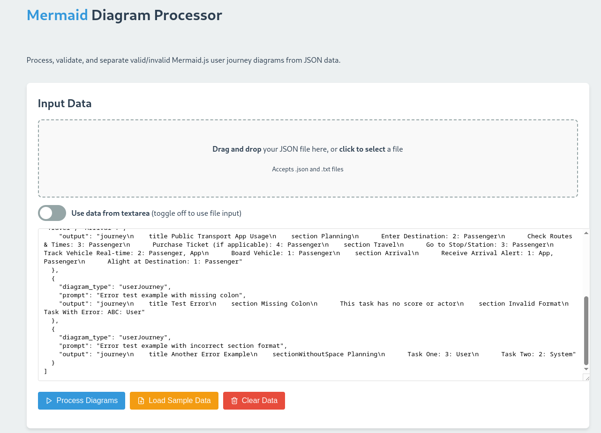
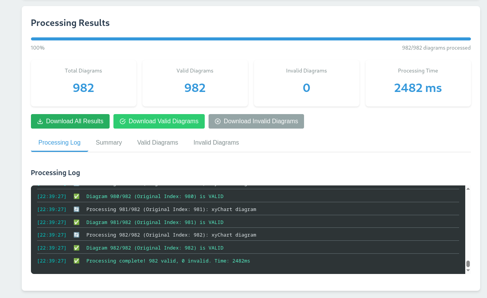

### `/previewer`

- Go to the `previewer` directory
- Run using `python -m http.server 3000`
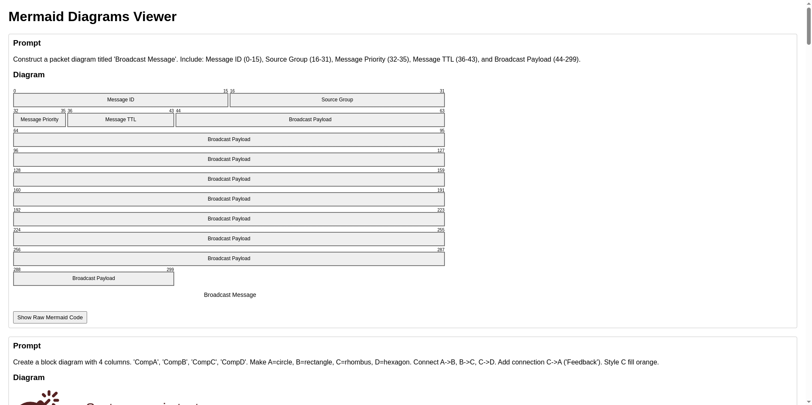

### `/phi_4_fine_tune` and `/gemini_fine_tune`

- Contains fine-tuning experiments with different models
- Includes training configurations and scripts
- Gemini model showed the best results
- Contains inference scripts for model evaluation

## Samples from dataset

Question

```text
Generate a Kanban diagram with columns 'To Do' (id: c1), 'Doing' (id: c2), 'Code Review' (id: c3), and 'Deployed' (id: c4). Add 'Fix Bug #123' (id: bug123) to 'Doing'. Add 'Review Pull Request #45' (id: pr45) to 'Code Review'. Add 'Deploy Version 2.1' (id: deploy21) to 'Deployed'.
```

Answer

```text
kanban c1[To Do]

c2[Doing] bug123[Fix Bug #123]

c3[Code Review] pr45[Review Pull Request #45]

c4[Deployed] deploy21[Deploy Version 2.1]
```
Rendered
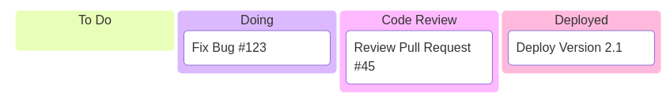

**Question**
```
Draw a Gantt diagram titled "Research Paper Timeline" with dateFormat YYYY-MM-DD, excluding weekends. Section "Research": "Literature Review" (ID: litRev) 2024-03-04, 4w. "Experiment Design" (ID: expDes) after litRev, 2w. "Data Collection" (ID: dataColl) active, after expDes, 6w. Section "Writing": "Draft Manuscript" (ID: draft) after dataColl, 4w. "Internal Review" (ID: intRev) after draft, 1w. Section "Submission": "Revisions" (ID: rev) after intRev, 2w. "Submission" (ID: submit) milestone, after rev, 0d.
```
Answer
```
gantt
 title Research Paper Timeline
 dateFormat YYYY-MM-DD
 excludes weekends
section Research
 Literature Review :litRev, 2024-03-04, 4w
 Experiment Design :expDes, after litRev, 2w
 Data Collection :active, dataColl, after expDes, 6w
section Writing
 Draft Manuscript :draft, after dataColl, 4w
 Internal Review :intRev, after draft, 1w
section Submission
 Revisions :rev, after intRev, 2w
 Submission :milestone, submit, after rev, 0d
```
Rendered
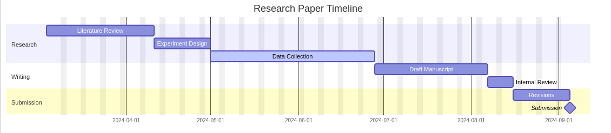

Question
```
Draw a complex ZenUML diagram: Parallel calls within Try/Catch/Finally. Participants: Gateway, Service1, Service2, FallbackService, Client, AuditLog. Client sends async request to Gateway. Gateway enters try { } block. Inside try, Gateway enters par { } block: calls sync Process1() on Service1 (res1 = Service1.Process1()), calls sync Process2() on Service2 (res2 = Service2.Process2()). Gateway combines results and returns to Client. catch { } block: Gateway calls sync GetFallback() on FallbackService (fallback_res = FallbackService.GetFallback()), returns fallback_res to Client. finally { } block: Gateway sends async LogAttempt to AuditLog.
```

Rendered
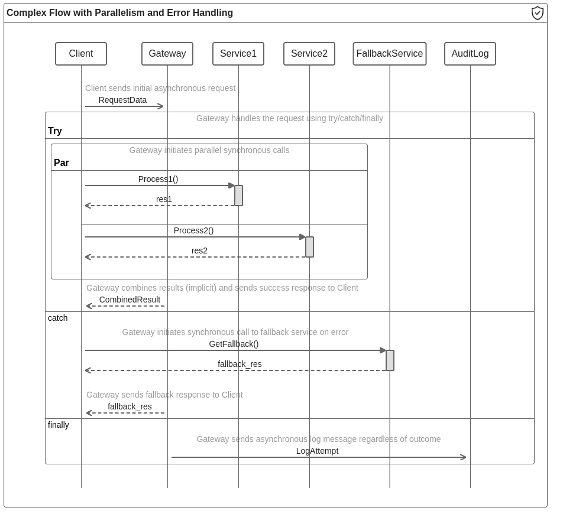

## Fine-tuned Gemini v/s Base Gemini


---

**Question:**
Construct a packet diagram titled 'Broadcast Message'. Include: Message ID (0-15), Source Group (16-31), Message Priority (32-35), Message TTL (36-43), and Broadcast Payload (44-299).

| Fine-tuned Model         | Base Model               |
| :----------------------- | :----------------------- |
| 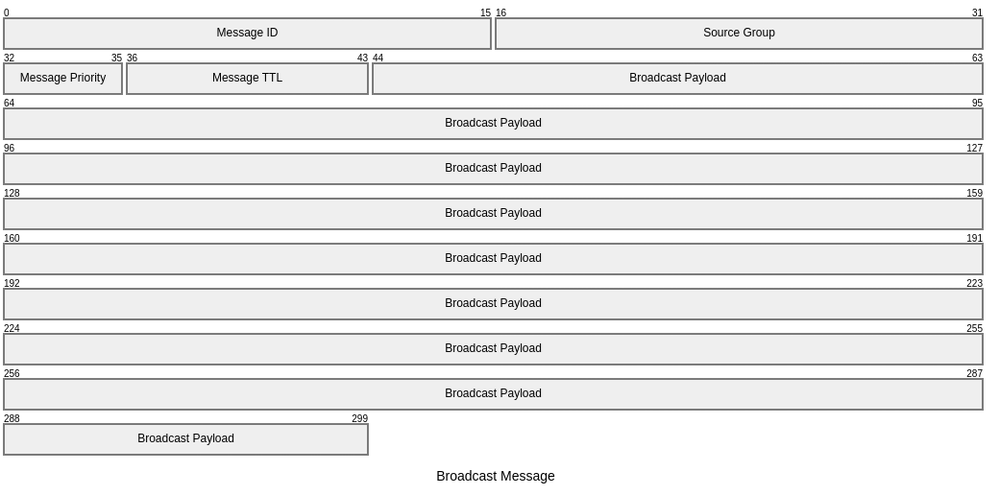 | 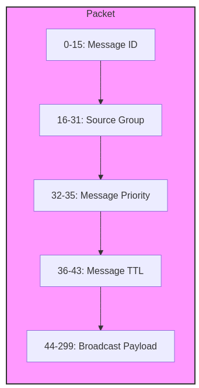 |

---

**Question:**
Construct a C4Deployment diagram using nested Deployment_Nodes extensively. Node('Global Network' (gn)). Inside gn: Node('Region A' (ra)). Inside ra: Node('Datacenter A1' (dc_a1)). Inside dc_a1: Node('Rack A1-1' (rk_a11)). Inside rk_a11: Node('Server A' (srv_a)), Container('App Instance A' (app_a)) inside srv_a. Node('Region B' (rb)). Inside rb: Node('Datacenter B1' (dc_b1)). Inside dc_b1: Node('Server B' (srv_b)), ContainerDb('Database B' (db_b)) inside srv_b. Relationship: Rel(app_a, db_b, 'Connects Across Regions').

| Fine-tuned Model         | Base Model       |
| :----------------------- | :--------------- |
| 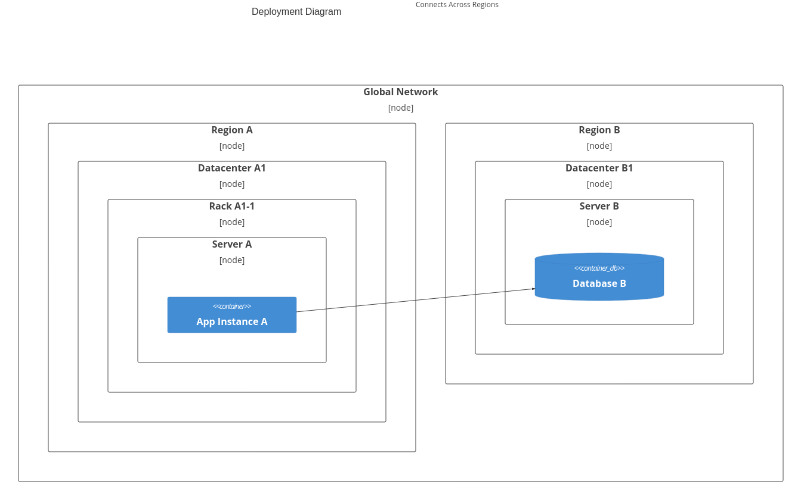 | Produces Error   |

---

**Question:**
Create an architecture diagram explicitly using standard icons: Group `vpc` (use 'cloud' icon) [VPC Network] contains service `api_gw` (use 'server' icon) [API Gateway] and service `lambda_func` (use 'server' icon) [Function]. Service `s3_bucket` (use 'disk' icon) [Storage Bucket] is also in `vpc`. Connect `api_gw`:R to `lambda_func`:L (`-->`). Connect `lambda_func`:B to `s3_bucket`:T (`-->`). Add service `external_db` (use 'database' icon) [External DB] outside `vpc`. Connect `lambda_func`:R to `external_db`:L (`-->`).

| Fine-tuned Model         | Base Model                |
| :----------------------- | :------------------------ |
| 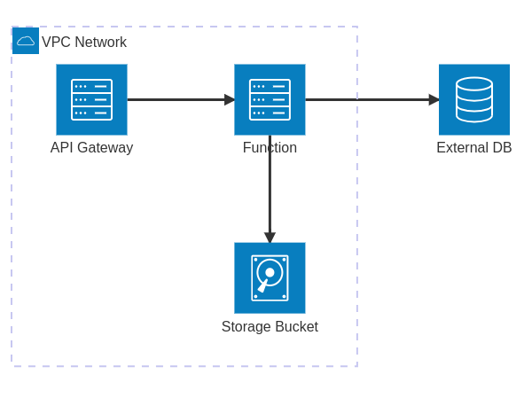 | 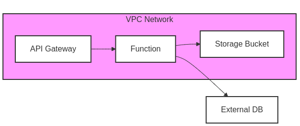 |

---

**Question:**
Create a gitgraph demonstrating branch ordering. Add commit `C0` on `main`. Branch `delta` with `order: 4`. Branch `alpha` with `order: 1`. Branch `gamma` with `order: 3`. Branch `beta` with `order: 2`. Add one commit to each of the created branches.

| Fine-tuned Model          | Base Model   |
| :------------------------ | :----------- |
| 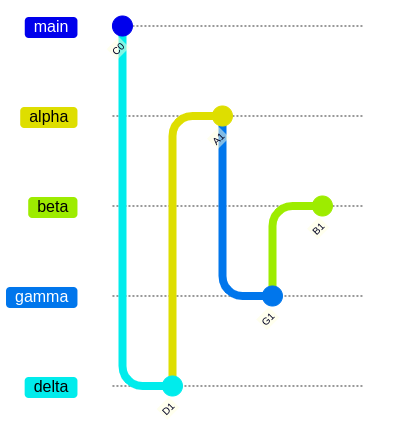 | Error        |

---
## Workflow

1. **Dataset Generation**: Generate deterministic question-answer pairs from Mermaid documentation
2. **Validation**: Check rendering success rate of generated diagrams
3. **Preview**: Manually inspect diagram quality
4. **Fine-tuning**: Train models on the generated dataset
5. **Inference**: Get model predictions for validation dataset and then use the Validation webapp to check the rendering success rate.

## Supported Diagram Types

The project supports various Mermaid diagram types including:

- Architecture diagrams
- Sequence diagrams (ZenUML)
- Gitgraph diagrams
- Timeline diagrams
- C4 diagrams
- Kanban boards
- Class diagrams
- State diagrams
- Requirement diagrams
- And more
